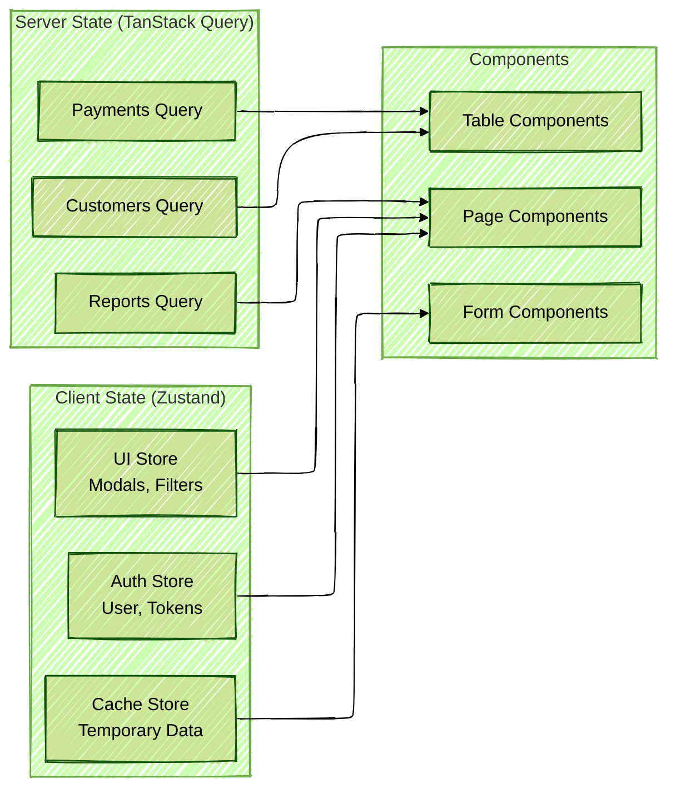

# VGS Municipal Assembly Web Ticketing System
## Software Architecture Document

### Version 1.0
### Date: October 2025

---

## Table of Contents
1. [Executive Summary](#executive-summary)
2. [Architecture Overview](#architecture-overview)
3. [Technology Stack](#technology-stack)
4. [System Architecture](#system-architecture)
5. [Backend Architecture (Clojure)](#backend-architecture-clojure)
6. [Frontend Architecture](#frontend-architecture)
7. [Database Architecture](#database-architecture)
8. [AWS Infrastructure](#aws-infrastructure)
9. [API Design](#api-design)
10. [Security Architecture](#security-architecture)
11. [Performance & Scalability](#performance--scalability)
12. [Deployment Strategy](#deployment-strategy)
13. [Monitoring & Observability](#monitoring--observability)
14. [Development Workflow](#development-workflow)

---

## 1. Executive Summary

The VGS Municipal Assembly Web Ticketing System is a comprehensive revenue collection platform designed for municipal assemblies in Ghana. The system manages ticketing for markets and lorry parks, featuring GPS tracking, payment processing, staff management, and extensive reporting capabilities.

### Key Architectural Decisions
- **Backend:** Clojure with Ring/Compojure for functional programming benefits and JVM ecosystem
- **Frontend:** Next.js with TypeScript, TailwindCSS for styling, shadcn/ui for components
- **Database:** PostgreSQL with PostGIS, isolated per client (no multi-tenancy)
- **Infrastructure:** AWS-hosted with RDS, S3, CloudFront CDN
- **Architecture Pattern:** Service-oriented architecture with clear separation of concerns

---

## 2. Architecture Overview


---

## 3. Technology Stack

### Backend Stack
| Component | Technology | Purpose |
|-----------|------------|---------|
| Language | Clojure 1.11+ | Functional programming, immutability, JVM ecosystem |
| Web Framework | Ring + Compojure | HTTP server and routing |
| API Framework | Reitit | Data-driven routing with swagger support |
| Database Library | next.jdbc + HoneySQL | Database interaction and query building |
| Authentication | Buddy | JWT tokens and security |
| Validation | Malli | Schema validation and coercion |
| Async Processing | core.async | Concurrent operations |
| Testing | clojure.test + Midje | Unit and integration testing |
| Build Tool | Leiningen / deps.edn | Dependency management and builds |

### Frontend Stack
| Component | Technology | Purpose |
|-----------|------------|---------|
| Framework | Next.js 15+ | React framework with SSR/SSG |
| Language | TypeScript | Type safety |
| Styling | TailwindCSS | Utility-first CSS framework |
| Components | shadcn/ui | Accessible component library |
| State Management | Zustand / TanStack Query | Global state and server state |
| Forms | React Hook Form + Zod | Form handling and validation |
| Maps | Leaflet + React-Leaflet | Interactive maps |
| Charts | Recharts | Data visualization |

### Infrastructure Stack
| Component | Technology | Purpose |
|-----------|------------|---------|
| Cloud Provider | AWS | Infrastructure and services |
| Database | RDS PostgreSQL + PostGIS | Relational data and spatial queries |
| Cache | ElastiCache Redis | Session storage and caching |
| File Storage | S3 | Documents, receipts, images |
| CDN | CloudFront | Content delivery |
| Container | Docker | Application containerization |
| Orchestration | ECS Fargate | Container management |
| CI/CD | GitHub Actions + AWS CodeDeploy | Deployment pipeline |

---

## 4. System Architecture

### 4.1 Component Architecture


### 4.2 Data Flow Architecture


---

## 5. Backend Architecture (Clojure)

### 5.1 Project Structure

```
ticketing-backend/
├── deps.edn                    # Dependencies
├── src/
│   └── vgs/
│       ├── core.clj           # Application entry point
│       ├── config.clj         # Configuration management
│       ├── server.clj         # Server setup
│       ├── routes/
│       │   ├── api.clj        # Main API routes
│       │   ├── auth.clj       # Authentication routes
│       │   ├── customers.clj  # Customer routes
│       │   ├── payments.clj   # Payment routes
│       │   └── admin.clj      # Admin routes
│       ├── handlers/
│       │   ├── auth.clj       # Auth business logic
│       │   ├── customers.clj  # Customer logic
│       │   ├── payments.clj   # Payment logic
│       │   └── reports.clj    # Report generation
│       ├── db/
│       │   ├── core.clj       # Database connection
│       │   ├── migrations.clj # Database migrations
│       │   └── queries.clj    # SQL queries (HoneySQL)
│       ├── models/
│       │   ├── customer.clj   # Customer schema
│       │   ├── payment.clj    # Payment schema
│       │   └── staff.clj      # Staff schema
│       ├── services/
│       │   ├── auth.clj       # JWT handling
│       │   ├── cache.clj      # Redis operations
│       │   ├── s3.clj         # S3 operations
│       │   └── sms.clj        # SMS integration
│       ├── middleware/
│       │   ├── auth.clj       # Auth middleware
│       │   ├── cors.clj       # CORS handling
│       │   └── logging.clj    # Request logging
│       └── utils/
│           ├── validation.clj # Malli schemas
│           └── response.clj   # Response helpers
├── test/
│   └── vgs/
│       └── [test files...]
└── resources/
    ├── config.edn             # Configuration
    └── migrations/            # SQL migrations
```

### 5.2 Core Components Implementation

#### Authentication Service (Buddy JWT)
```clojure
(ns vgs.services.auth
  (:require [buddy.sign.jwt :as jwt]
            [buddy.hashers :as hashers]
            [vgs.config :refer [config]]))

(defn create-token
  "Creates a JWT token for authenticated user"
  [user]
  (let [exp (-> (java.time.Instant/now)
                (.plusSeconds 900)  ; 15 minutes
                (.getEpochSecond))
        claims {:user-id (:id user)
                :role (:role user)
                :zones (:zones user)
                :exp exp}]
    (jwt/sign claims (:jwt-secret config))))

(defn verify-token
  "Verifies and decodes JWT token"
  [token]
  (try
    (jwt/unsign token (:jwt-secret config))
    (catch Exception _ nil)))
```

#### Database Repository Pattern
```clojure
(ns vgs.db.repositories.customer
  (:require [next.jdbc :as jdbc]
            [honey.sql :as sql]
            [vgs.db.core :refer [db-spec]]))

(defn find-by-zone
  "Find customers by zone with pagination"
  [zone-id {:keys [page limit search months-owed]}]
  (let [offset (* (dec page) limit)
        query (cond-> {:select [:*]
                       :from [:customers]
                       :where [:= :zone_id zone-id]}
                search
                (update :where conj [:ilike :customer_number
                                    (str "%" search "%")])
                months-owed
                (update :where conj [:>= :months_owed months-owed])
                true
                (assoc :limit limit :offset offset))]
    (jdbc/execute! db-spec (sql/format query))))
```

#### Caching Layer
```clojure
(ns vgs.services.cache
  (:require [taoensso.carmine :as car]))

(defmacro wcar* [& body]
  `(car/wcar {:pool {} :spec {:uri (:redis-url config)}}
             ~@body))

(defn cache-get [key]
  (wcar* (car/get key)))

(defn cache-set
  ([key value] (cache-set key value 300))  ; 5 min default
  ([key value ttl]
   (wcar* (car/setex key ttl value))))

(defn with-cache
  "Wraps a function with caching"
  [cache-key ttl f]
  (fn [& args]
    (let [key (str cache-key ":" (hash args))]
      (if-let [cached (cache-get key)]
        cached
        (let [result (apply f args)]
          (cache-set key result ttl)
          result)))))
```

### 5.3 API Routes Structure

```clojure
(ns vgs.routes.api
  (:require [reitit.ring :as ring]
            [reitit.swagger :as swagger]
            [reitit.swagger-ui :as swagger-ui]
            [vgs.middleware.auth :refer [wrap-auth]]
            [vgs.handlers.customers :as customers]
            [vgs.handlers.payments :as payments]))

(def routes
  [["/swagger.json"
    {:get {:no-doc true
           :swagger {:info {:title "VGS Ticketing API"
                           :description "Municipal ticketing system"
                           :version "1.0.0"}}
           :handler (swagger/create-swagger-handler)}}]

   ["/api/v1"
    {:middleware [wrap-auth]}

    ["/customers"
     {:get {:summary "List customers"
            :parameters {:query [:map
                               [:zone string?]
                               [:page {:optional true} int?]
                               [:limit {:optional true} int?]]}
            :handler customers/list-customers}
      :post {:summary "Create customer"
             :parameters {:body customer-schema}
             :handler customers/create-customer}}]

    ["/customers/:id"
     {:get {:summary "Get customer details"
            :parameters {:path [:map [:id uuid?]]}
            :handler customers/get-customer}
      :put {:summary "Update customer"
            :parameters {:path [:map [:id uuid?]]
                        :body customer-schema}
            :handler customers/update-customer}}]

    ["/payments"
     {:get {:summary "List payments"
            :handler payments/list-payments}
      :post {:summary "Record payment"
             :parameters {:body payment-schema}
             :handler payments/create-payment}}]]])
```

---

## 6. Frontend Architecture

### 6.1 Component Structure with shadcn/ui

```typescript
// components/ui/data-table.tsx - Using shadcn/ui components
import {
  Table,
  TableBody,
  TableCell,
  TableHead,
  TableHeader,
  TableRow,
} from "@/components/ui/table"
import { Button } from "@/components/ui/button"
import { Input } from "@/components/ui/input"
import {
  DropdownMenu,
  DropdownMenuContent,
  DropdownMenuItem,
  DropdownMenuTrigger,
} from "@/components/ui/dropdown-menu"

interface DataTableProps<T> {
  columns: ColumnDef<T>[]
  data: T[]
  searchKey?: string
}

export function DataTable<T>({
  columns,
  data,
  searchKey
}: DataTableProps<T>) {
  // Implementation using shadcn/ui components
}
```

### 6.2 State Management Architecture



### 6.3 API Client Architecture

```typescript
// lib/api/client.ts
import axios from 'axios'
import { useAuthStore } from '@/stores/auth'

const apiClient = axios.create({
  baseURL: process.env.NEXT_PUBLIC_API_URL,
  timeout: 10000,
})

// Request interceptor for auth
apiClient.interceptors.request.use((config) => {
  const token = useAuthStore.getState().token
  if (token) {
    config.headers.Authorization = `Bearer ${token}`
  }
  return config
})

// Response interceptor for error handling
apiClient.interceptors.response.use(
  (response) => response,
  async (error) => {
    if (error.response?.status === 401) {
      // Handle token refresh
      const refreshToken = useAuthStore.getState().refreshToken
      if (refreshToken) {
        try {
          const { data } = await axios.post('/api/auth/refresh', {
            refreshToken
          })
          useAuthStore.setState({ token: data.token })
          return apiClient.request(error.config)
        } catch {
          useAuthStore.getState().logout()
        }
      }
    }
    return Promise.reject(error)
  }
)
```

---

## 7. Database Architecture

### 7.1 Schema Design (PostgreSQL + PostGIS)


### 7.2 Performance Indexes

```sql
-- Customer performance indexes
CREATE INDEX idx_customers_zone ON customers(zone_id);
CREATE INDEX idx_customers_number ON customers(customer_number);
CREATE INDEX idx_customers_phone ON customers(phone);
CREATE INDEX idx_customers_months_owed ON customers(months_owed);
CREATE INDEX idx_customers_location ON customers USING GIST(location);

-- Payment performance indexes
CREATE INDEX idx_payments_customer ON payments(customer_id);
CREATE INDEX idx_payments_date ON payments(created_at);
CREATE INDEX idx_payments_staff ON payments(staff_id);
CREATE INDEX idx_payments_status ON payments(status);

-- Full-text search
CREATE INDEX idx_customers_search ON customers
  USING GIN(to_tsvector('english',
    coalesce(customer_number, '') || ' ' ||
    coalesce(name, '') || ' ' ||
    coalesce(phone, '')));

-- Spatial indexes for GPS queries
CREATE INDEX idx_zones_boundary ON zones USING GIST(boundary);
CREATE INDEX idx_payments_coordinates ON payments USING GIST(coordinates);
```

### 7.3 Database Per Client Strategy


#### Database Connection Management (Clojure)
```clojure
(ns vgs.db.multi-tenant
  (:require [next.jdbc :as jdbc]
            [hikari-cp.core :as hikari]))

(defn create-client-datasource
  "Creates a datasource for a specific client database"
  [client-id]
  (let [db-name (str "vgs_" client-id)
        config {:adapter "postgresql"
                :username (env :db-user)
                :password (env :db-password)
                :database-name db-name
                :server-name (env :rds-endpoint)
                :port-number 5432
                :maximum-pool-size 10
                :connection-timeout 30000}]
    (hikari/make-datasource config)))

(def client-connections (atom {}))

(defn get-client-connection
  "Gets or creates a connection for a client"
  [client-id]
  (if-let [ds (get @client-connections client-id)]
    ds
    (let [ds (create-client-datasource client-id)]
      (swap! client-connections assoc client-id ds)
      ds)))

(defmacro with-client-db
  "Executes database operations for a specific client"
  [client-id & body]
  `(jdbc/with-transaction [tx# (get-client-connection ~client-id)]
     ~@body))
```

---

## 8. AWS Infrastructure

### 8.1 AWS Services Architecture


### 8.2 Infrastructure as Code (Terraform)

```hcl
# main.tf - Core infrastructure

# VPC Configuration
module "vpc" {
  source = "terraform-aws-modules/vpc/aws"
  version = "5.0.0"

  name = "vgs-ticketing-vpc"
  cidr = "10.0.0.0/16"

  azs             = ["us-east-1a", "us-east-1b"]
  private_subnets = ["10.0.1.0/24", "10.0.2.0/24"]
  public_subnets  = ["10.0.101.0/24", "10.0.102.0/24"]
  database_subnets = ["10.0.201.0/24", "10.0.202.0/24"]

  enable_nat_gateway = true
  enable_vpn_gateway = false
  enable_dns_hostnames = true
  enable_dns_support = true
}

# RDS PostgreSQL with PostGIS
resource "aws_db_instance" "postgres" {
  for_each = var.client_databases  # One per client

  identifier = "vgs-${each.key}-db"
  engine = "postgres"
  engine_version = "14.9"
  instance_class = "db.t3.medium"
  allocated_storage = 100
  storage_type = "gp3"
  storage_encrypted = true

  db_name = "vgs_${each.key}"
  username = "vgs_admin"
  password = random_password.db_password[each.key].result

  vpc_security_group_ids = [aws_security_group.rds.id]
  db_subnet_group_name = aws_db_subnet_group.main.name

  backup_retention_period = 30
  backup_window = "03:00-04:00"
  maintenance_window = "sun:04:00-sun:05:00"

  multi_az = true
  deletion_protection = true

  performance_insights_enabled = true
  monitoring_interval = 60

  tags = {
    Name = "VGS-${each.key}-Database"
    Client = each.key
  }
}

# ElastiCache Redis
resource "aws_elasticache_cluster" "redis" {
  cluster_id = "vgs-cache"
  engine = "redis"
  node_type = "cache.t3.micro"
  num_cache_nodes = 1
  port = 6379

  subnet_group_name = aws_elasticache_subnet_group.main.name
  security_group_ids = [aws_security_group.redis.id]

  snapshot_retention_limit = 5
  snapshot_window = "03:00-05:00"

  tags = {
    Name = "VGS-Redis-Cache"
  }
}

# S3 Buckets
resource "aws_s3_bucket" "artifacts" {
  bucket = "vgs-ticketing-artifacts"

  tags = {
    Name = "VGS Artifacts"
  }
}

resource "aws_s3_bucket_versioning" "artifacts" {
  bucket = aws_s3_bucket.artifacts.id

  versioning_configuration {
    status = "Enabled"
  }
}

resource "aws_s3_bucket_lifecycle_configuration" "artifacts" {
  bucket = aws_s3_bucket.artifacts.id

  rule {
    id = "archive-old-receipts"
    status = "Enabled"

    transition {
      days = 90
      storage_class = "STANDARD_IA"
    }

    transition {
      days = 365
      storage_class = "GLACIER"
    }
  }
}

# CloudFront Distribution
resource "aws_cloudfront_distribution" "main" {
  enabled = true
  is_ipv6_enabled = true
  default_root_object = "index.html"

  origin {
    domain_name = aws_alb.main.dns_name
    origin_id = "ALB-${aws_alb.main.id}"

    custom_origin_config {
      http_port = 80
      https_port = 443
      origin_protocol_policy = "https-only"
      origin_ssl_protocols = ["TLSv1.2"]
    }
  }

  origin {
    domain_name = aws_s3_bucket.artifacts.bucket_regional_domain_name
    origin_id = "S3-${aws_s3_bucket.artifacts.id}"

    s3_origin_config {
      origin_access_identity = aws_cloudfront_origin_access_identity.main.cloudfront_access_identity_path
    }
  }

  default_cache_behavior {
    allowed_methods = ["DELETE", "GET", "HEAD", "OPTIONS", "PATCH", "POST", "PUT"]
    cached_methods = ["GET", "HEAD", "OPTIONS"]
    target_origin_id = "ALB-${aws_alb.main.id}"

    forwarded_values {
      query_string = true
      headers = ["Authorization", "Origin", "Accept", "Accept-Language"]

      cookies {
        forward = "all"
      }
    }

    viewer_protocol_policy = "redirect-to-https"
    min_ttl = 0
    default_ttl = 0
    max_ttl = 0
  }

  ordered_cache_behavior {
    path_pattern = "/static/*"
    allowed_methods = ["GET", "HEAD"]
    cached_methods = ["GET", "HEAD"]
    target_origin_id = "S3-${aws_s3_bucket.artifacts.id}"

    forwarded_values {
      query_string = false
      cookies {
        forward = "none"
      }
    }

    viewer_protocol_policy = "https-only"
    min_ttl = 86400
    default_ttl = 604800
    max_ttl = 31536000
    compress = true
  }

  restrictions {
    geo_restriction {
      restriction_type = "none"
    }
  }

  viewer_certificate {
    cloudfront_default_certificate = true
  }

  web_acl_id = aws_wafv2_web_acl.main.arn
}

# ECS Fargate Cluster
resource "aws_ecs_cluster" "main" {
  name = "vgs-ticketing-cluster"

  setting {
    name = "containerInsights"
    value = "enabled"
  }
}

resource "aws_ecs_task_definition" "api" {
  family = "vgs-api"
  network_mode = "awsvpc"
  requires_compatibilities = ["FARGATE"]
  cpu = "1024"
  memory = "2048"
  execution_role_arn = aws_iam_role.ecs_execution.arn
  task_role_arn = aws_iam_role.ecs_task.arn

  container_definitions = jsonencode([
    {
      name = "api"
      image = "${aws_ecr_repository.api.repository_url}:latest"

      portMappings = [
        {
          containerPort = 3000
          protocol = "tcp"
        }
      ]

      environment = [
        {
          name = "ENV"
          value = "production"
        }
      ]

      secrets = [
        {
          name = "DB_PASSWORD"
          valueFrom = aws_secretsmanager_secret.db_password.arn
        },
        {
          name = "JWT_SECRET"
          valueFrom = aws_secretsmanager_secret.jwt_secret.arn
        }
      ]

      logConfiguration = {
        logDriver = "awslogs"
        options = {
          "awslogs-group" = aws_cloudwatch_log_group.ecs.name
          "awslogs-region" = var.aws_region
          "awslogs-stream-prefix" = "api"
        }
      }
    }
  ])
}

resource "aws_ecs_service" "api" {
  name = "vgs-api-service"
  cluster = aws_ecs_cluster.main.id
  task_definition = aws_ecs_task_definition.api.arn
  desired_count = 2
  launch_type = "FARGATE"

  network_configuration {
    subnets = module.vpc.private_subnets
    security_groups = [aws_security_group.ecs_tasks.id]
  }

  load_balancer {
    target_group_arn = aws_lb_target_group.api.arn
    container_name = "api"
    container_port = 3000
  }

  deployment_configuration {
    maximum_percent = 200
    minimum_healthy_percent = 100
  }

  enable_execute_command = true
}
```

---

## 9. API Design

### 9.1 RESTful API Standards

```yaml
# OpenAPI 3.0 Specification
openapi: 3.0.0
info:
  title: VGS Ticketing API
  version: 1.0.0
  description: Municipal Assembly Ticketing System API

servers:
  - url: https://api.vgs-ticketing.com/v1
    description: Production

paths:
  /auth/login:
    post:
      summary: User login
      requestBody:
        required: true
        content:
          application/json:
            schema:
              type: object
              required:
                - username
                - password
              properties:
                username:
                  type: string
                password:
                  type: string
      responses:
        200:
          description: Login successful
          content:
            application/json:
              schema:
                type: object
                properties:
                  token:
                    type: string
                  refreshToken:
                    type: string
                  user:
                    $ref: '#/components/schemas/User'

  /customers:
    get:
      summary: List customers
      security:
        - bearerAuth: []
      parameters:
        - name: zone
          in: query
          schema:
            type: string
        - name: page
          in: query
          schema:
            type: integer
            default: 1
        - name: limit
          in: query
          schema:
            type: integer
            default: 50
        - name: search
          in: query
          schema:
            type: string
      responses:
        200:
          description: List of customers
          content:
            application/json:
              schema:
                type: object
                properties:
                  data:
                    type: array
                    items:
                      $ref: '#/components/schemas/Customer'
                  pagination:
                    $ref: '#/components/schemas/Pagination'

    post:
      summary: Create customer
      security:
        - bearerAuth: []
      requestBody:
        required: true
        content:
          application/json:
            schema:
              $ref: '#/components/schemas/CustomerInput'
      responses:
        201:
          description: Customer created
          content:
            application/json:
              schema:
                $ref: '#/components/schemas/Customer'

components:
  schemas:
    Customer:
      type: object
      properties:
        id:
          type: string
          format: uuid
        customerNumber:
          type: string
        name:
          type: string
        phone:
          type: string
        location:
          type: object
          properties:
            latitude:
              type: number
            longitude:
              type: number
        zoneId:
          type: string
        monthsOwed:
          type: integer
        lastPaymentDate:
          type: string
          format: date
        status:
          type: string
          enum: [Active, Inactive]
```

### 9.2 API Response Standards

```clojure
(ns vgs.utils.response)

(defn success
  "Standard success response"
  ([data] (success data nil))
  ([data meta]
   {:status 200
    :body {:success true
           :data data
           :meta meta
           :timestamp (java.time.Instant/now)}}))

(defn error
  "Standard error response"
  [status message & [{:keys [errors code]}]]
  {:status status
   :body {:success false
          :message message
          :code code
          :errors errors
          :timestamp (java.time.Instant/now)}})

(defn paginated
  "Paginated response with metadata"
  [data page limit total]
  (success data {:pagination {:page page
                              :limit limit
                              :total total
                              :totalPages (Math/ceil (/ total limit))}}))
```

---

## 10. Security Architecture

### 10.1 Security Layers


### 10.2 Authentication & Authorization Flow

```clojure
(ns vgs.middleware.auth
  (:require [vgs.services.auth :as auth]
            [vgs.db.repositories.users :as users]))

(defn wrap-auth
  "Authentication middleware"
  [handler]
  (fn [request]
    (if-let [token (get-in request [:headers "authorization"])]
      (if-let [claims (auth/verify-token (str/replace token "Bearer " ""))]
        (let [user (users/find-by-id (:user-id claims))]
          (handler (assoc request :user user :claims claims)))
        {:status 401 :body {:error "Invalid token"}})
      {:status 401 :body {:error "No token provided"}})))

(defn require-role
  "Role-based authorization"
  [& roles]
  (fn [handler]
    (fn [request]
      (let [user-role (get-in request [:user :role])]
        (if (some #{user-role} roles)
          (handler request)
          {:status 403 :body {:error "Insufficient permissions"}})))))

(defn require-zone-access
  "Zone-based data filtering"
  [handler]
  (fn [request]
    (let [user-zones (get-in request [:user :zones])
          requested-zone (get-in request [:params :zone-id])]
      (if (or (= "global" (get-in request [:user :access-type]))
              (some #{requested-zone} user-zones))
        (handler request)
        {:status 403 :body {:error "No access to this zone"}}))))
```

---

## 11. Performance & Scalability

### 11.1 Performance Architecture


### 11.2 Scalability Strategies

#### Horizontal Scaling Plan

| Component | Current (MVP) | 6 Months | 1 Year | 2+ Years |
|-----------|--------------|----------|---------|----------|
| **API Servers** | 2 instances | 4 instances | 8 instances | Auto-scaling (2-20) |
| **Database** | Single RDS | Read Replica | Multi-AZ + Replicas | Aurora Serverless |
| **Cache** | 1 Redis Node | 2 Node Cluster | 3 Node Cluster | ElastiCache Cluster |
| **File Storage** | S3 Standard | S3 + Lifecycle | S3 + CloudFront | Multi-region S3 |
| **Background Jobs** | In-process | SQS + Lambda | Step Functions | Kubernetes Jobs |

#### Performance Metrics & Targets

```clojure
(ns vgs.monitoring.metrics
  (:require [metrics.core :as metrics]
            [metrics.timers :as timers]))

;; Performance targets
(def performance-targets
  {:api-response-time {:p50 100   ; ms
                       :p95 500
                       :p99 1000}
   :database-query {:p50 20
                   :p95 100
                   :p99 200}
   :cache-hit-rate 0.85  ; 85%
   :error-rate 0.001     ; 0.1%
   :availability 0.999}) ; 99.9%

;; Monitoring implementation
(def api-timer (timers/timer ["api" "response-time"]))

(defmacro with-metrics [metric-name & body]
  `(timers/time! ~metric-name
     ~@body))

;; Usage in handlers
(defn get-customers [request]
  (with-metrics api-timer
    (let [zone-id (get-in request [:params :zone-id])
          cache-key (str "customers:" zone-id)]
      (or (cache/get cache-key)
          (let [customers (db/find-customers zone-id)]
            (cache/set cache-key customers 300)
            customers)))))
```

### 11.3 Database Performance Optimization

#### Query Optimization Strategies

```sql
-- Optimized customer search with full-text and spatial queries
CREATE OR REPLACE FUNCTION search_customers(
  p_search TEXT,
  p_zone_id UUID,
  p_months_owed INT,
  p_lat FLOAT,
  p_lon FLOAT,
  p_radius_km FLOAT,
  p_limit INT,
  p_offset INT
) RETURNS TABLE(
  id UUID,
  customer_number VARCHAR,
  name VARCHAR,
  phone VARCHAR,
  distance_km FLOAT
) AS $$
BEGIN
  RETURN QUERY
  WITH filtered AS (
    SELECT
      c.id,
      c.customer_number,
      c.name,
      c.phone,
      ST_Distance_Sphere(
        c.location,
        ST_MakePoint(p_lon, p_lat)
      ) / 1000 as distance_km
    FROM customers c
    WHERE
      (p_zone_id IS NULL OR c.zone_id = p_zone_id)
      AND (p_months_owed IS NULL OR c.months_owed >= p_months_owed)
      AND (p_search IS NULL OR
           c.search_vector @@ plainto_tsquery('english', p_search))
      AND (p_radius_km IS NULL OR
           ST_DWithin(
             c.location::geography,
             ST_MakePoint(p_lon, p_lat)::geography,
             p_radius_km * 1000
           ))
      AND c.status = 'Active'
  )
  SELECT * FROM filtered
  ORDER BY
    CASE WHEN p_lat IS NOT NULL THEN distance_km ELSE 0 END,
    customer_number
  LIMIT p_limit
  OFFSET p_offset;
END;
$$ LANGUAGE plpgsql;

-- Create supporting indexes
CREATE INDEX idx_customers_search_vector ON customers
  USING GIN(search_vector);
CREATE INDEX idx_customers_location_geography ON customers
  USING GIST(location::geography);
CREATE INDEX idx_customers_composite ON customers
  (zone_id, status, months_owed);
```

#### Materialized Views for Reports

```sql
-- Dashboard statistics materialized view
CREATE MATERIALIZED VIEW dashboard_stats AS
WITH date_ranges AS (
  SELECT
    date_trunc('day', CURRENT_DATE) as today,
    date_trunc('week', CURRENT_DATE) as this_week,
    date_trunc('month', CURRENT_DATE) as this_month,
    date_trunc('year', CURRENT_DATE) as this_year
),
payment_stats AS (
  SELECT
    COUNT(*) FILTER (WHERE p.created_at >= dr.today) as payments_today,
    COUNT(*) FILTER (WHERE p.created_at >= dr.this_week) as payments_week,
    COUNT(*) FILTER (WHERE p.created_at >= dr.this_month) as payments_month,
    SUM(p.amount) FILTER (WHERE p.created_at >= dr.today) as revenue_today,
    SUM(p.amount) FILTER (WHERE p.created_at >= dr.this_week) as revenue_week,
    SUM(p.amount) FILTER (WHERE p.created_at >= dr.this_month) as revenue_month,
    COUNT(DISTINCT p.customer_id) FILTER (WHERE p.created_at >= dr.this_month) as unique_customers
  FROM payments p, date_ranges dr
  WHERE p.status = 'Paid'
),
customer_stats AS (
  SELECT
    COUNT(*) as total_customers,
    COUNT(*) FILTER (WHERE months_owed = 0) as customers_current,
    COUNT(*) FILTER (WHERE months_owed BETWEEN 1 AND 3) as customers_owing_1_3,
    COUNT(*) FILTER (WHERE months_owed > 3) as customers_owing_over_3,
    AVG(months_owed) as avg_months_owed
  FROM customers
  WHERE status = 'Active'
)
SELECT
  ps.*,
  cs.*,
  NOW() as last_updated
FROM payment_stats ps, customer_stats cs;

-- Refresh strategy
CREATE INDEX ON dashboard_stats(last_updated);

-- Refresh every 5 minutes
CREATE OR REPLACE FUNCTION refresh_dashboard_stats()
RETURNS void AS $$
BEGIN
  REFRESH MATERIALIZED VIEW CONCURRENTLY dashboard_stats;
END;
$$ LANGUAGE plpgsql;

-- Schedule with pg_cron
SELECT cron.schedule('refresh-dashboard-stats', '*/5 * * * *',
  'SELECT refresh_dashboard_stats()');
```

### 11.4 Application Performance Optimization

```clojure
(ns vgs.performance.optimization
  (:require [clojure.core.async :as async]
            [clojure.core.memoize :as memo]))

;; Batch processing for bulk operations
(defn batch-process
  "Process items in batches for better performance"
  [items batch-size process-fn]
  (let [batches (partition-all batch-size items)
        results-chan (async/chan)]
    (doseq [batch batches]
      (async/go
        (let [result (process-fn batch)]
          (async/>! results-chan result))))
    (async/<!! (async/into [] results-chan))))

;; Memoization for expensive computations
(def calculate-customer-stats
  (memo/ttl
    (fn [zone-id date-range]
      ;; Expensive calculation
      (db/calculate-stats zone-id date-range))
    :ttl/threshold 300000)) ; Cache for 5 minutes

;; Connection pooling configuration
(def db-spec
  {:dbtype "postgresql"
   :dbname (env :db-name)
   :host (env :db-host)
   :user (env :db-user)
   :password (env :db-password)
   :maximumPoolSize 20
   :minimumIdle 5
   :connectionTimeout 30000
   :idleTimeout 600000
   :maxLifetime 1800000})

;; Lazy pagination
(defn paginate-query
  "Returns a lazy sequence of paginated results"
  [query-fn page-size]
  (letfn [(fetch-page [offset]
            (lazy-seq
              (when-let [results (seq (query-fn offset page-size))]
                (concat results (fetch-page (+ offset page-size))))))]
    (fetch-page 0)))
```

### 11.5 Monitoring & Performance Tracking

```clojure
(ns vgs.monitoring.performance
  (:require [taoensso.timbre :as log]
            [metrics.core :as metrics]
            [metrics.timers :as timers]
            [metrics.meters :as meters]
            [metrics.histograms :as histograms]))

;; Metrics registry
(def registry (metrics/new-registry))

;; Performance metrics
(def api-response-timer (timers/timer registry ["api" "response-time"]))
(def db-query-timer (timers/timer registry ["db" "query-time"]))
(def cache-hit-meter (meters/meter registry ["cache" "hits"]))
(def cache-miss-meter (meters/meter registry ["cache" "misses"]))
(def error-meter (meters/meter registry ["errors"]))

;; CloudWatch integration
(defn send-to-cloudwatch
  "Send metrics to AWS CloudWatch"
  []
  (let [metrics (metrics/metrics registry)]
    (doseq [[metric-name metric-value] metrics]
      ;; Send to CloudWatch
      (cloudwatch/put-metric-data
        {:namespace "VGS/Ticketing"
         :metric-name (str metric-name)
         :value metric-value
         :timestamp (java.time.Instant/now)}))))

;; Performance middleware
(defn wrap-performance-monitoring
  [handler]
  (fn [request]
    (timers/time! api-response-timer
      (try
        (let [response (handler request)]
          (when (>= (:status response) 500)
            (meters/mark! error-meter))
          response)
        (catch Exception e
          (meters/mark! error-meter)
          (log/error e "Request failed")
          (throw e))))))

;; Database query monitoring
(defmacro with-db-metrics [& body]
  `(timers/time! db-query-timer ~@body))

;; Cache monitoring
(defn cache-get-with-metrics [key]
  (if-let [value (cache/get key)]
    (do (meters/mark! cache-hit-meter) value)
    (do (meters/mark! cache-miss-meter) nil)))
```

---

## 12. Deployment Strategy

### 12.1 CI/CD Pipeline


### 12.2 GitHub Actions Workflow

```yaml
# .github/workflows/deploy.yml
name: Deploy to AWS

on:
  push:
    branches: [main]
  pull_request:
    branches: [main]

env:
  AWS_REGION: us-east-1
  ECR_REPOSITORY: vgs-ticketing-api

jobs:
  test:
    runs-on: ubuntu-latest
    steps:
      - uses: actions/checkout@v3

      - name: Setup Clojure
        uses: DeLaGuardo/setup-clojure@v1
        with:
          cli: latest

      - name: Cache dependencies
        uses: actions/cache@v3
        with:
          path: ~/.m2
          key: ${{ runner.os }}-m2-${{ hashFiles('**/deps.edn') }}

      - name: Run tests
        run: |
          clojure -M:test

      - name: Run linter
        run: |
          clojure -M:lint

  build-and-push:
    needs: test
    runs-on: ubuntu-latest
    if: github.ref == 'refs/heads/main'

    steps:
      - uses: actions/checkout@v3

      - name: Configure AWS credentials
        uses: aws-actions/configure-aws-credentials@v2
        with:
          aws-access-key-id: ${{ secrets.AWS_ACCESS_KEY_ID }}
          aws-secret-access-key: ${{ secrets.AWS_SECRET_ACCESS_KEY }}
          aws-region: ${{ env.AWS_REGION }}

      - name: Login to Amazon ECR
        id: login-ecr
        uses: aws-actions/amazon-ecr-login@v1

      - name: Build and push Docker image
        env:
          ECR_REGISTRY: ${{ steps.login-ecr.outputs.registry }}
          IMAGE_TAG: ${{ github.sha }}
        run: |
          docker build -t $ECR_REGISTRY/$ECR_REPOSITORY:$IMAGE_TAG .
          docker push $ECR_REGISTRY/$ECR_REPOSITORY:$IMAGE_TAG
          docker tag $ECR_REGISTRY/$ECR_REPOSITORY:$IMAGE_TAG \
                     $ECR_REGISTRY/$ECR_REPOSITORY:latest
          docker push $ECR_REGISTRY/$ECR_REPOSITORY:latest

  deploy-staging:
    needs: build-and-push
    runs-on: ubuntu-latest
    environment: staging

    steps:
      - name: Configure AWS credentials
        uses: aws-actions/configure-aws-credentials@v2
        with:
          aws-access-key-id: ${{ secrets.AWS_ACCESS_KEY_ID }}
          aws-secret-access-key: ${{ secrets.AWS_SECRET_ACCESS_KEY }}
          aws-region: ${{ env.AWS_REGION }}

      - name: Deploy to ECS
        run: |
          aws ecs update-service \
            --cluster vgs-staging-cluster \
            --service vgs-api-service \
            --force-new-deployment

  deploy-production:
    needs: deploy-staging
    runs-on: ubuntu-latest
    environment: production

    steps:
      - name: Configure AWS credentials
        uses: aws-actions/configure-aws-credentials@v2
        with:
          aws-access-key-id: ${{ secrets.AWS_ACCESS_KEY_ID }}
          aws-secret-access-key: ${{ secrets.AWS_SECRET_ACCESS_KEY }}
          aws-region: ${{ env.AWS_REGION }}

      - name: Deploy to ECS
        run: |
          aws ecs update-service \
            --cluster vgs-production-cluster \
            --service vgs-api-service \
            --force-new-deployment
```

### 12.3 Docker Configuration

```dockerfile
# Dockerfile
FROM clojure:openjdk-17-slim AS builder

WORKDIR /app

# Copy deps and cache dependencies
COPY deps.edn .
RUN clojure -P

# Copy source and build uberjar
COPY . .
RUN clojure -T:build uber

FROM openjdk:17-jre-slim

RUN apt-get update && apt-get install -y \
    curl \
    && rm -rf /var/lib/apt/lists/*

WORKDIR /app

COPY --from=builder /app/target/vgs-ticketing-*.jar app.jar

# Health check
HEALTHCHECK --interval=30s --timeout=3s --start-period=5s --retries=3 \
  CMD curl -f http://localhost:3000/health || exit 1

EXPOSE 3000

ENTRYPOINT ["java", "-Xmx1g", "-jar", "app.jar"]
```

---

## 13. Monitoring & Observability

### 13.1 Observability Stack


### 13.2 Key Metrics & Alerts

| Metric | Warning Threshold | Critical Threshold | Action |
|--------|------------------|-------------------|--------|
| API Response Time (p95) | > 500ms | > 1000ms | Scale out ECS tasks |
| Error Rate | > 1% | > 5% | Page on-call engineer |
| Database CPU | > 70% | > 90% | Scale up RDS instance |
| Database Connections | > 80% | > 95% | Increase connection pool |
| Cache Hit Rate | < 80% | < 60% | Review caching strategy |
| Disk Usage | > 80% | > 90% | Increase storage |
| Memory Usage | > 80% | > 90% | Scale up instances |
| Queue Depth | > 1000 | > 5000 | Scale workers |

---

## 14. Development Workflow

### 14.1 Development Environment Setup

```bash
# Setup script for developers
#!/bin/bash

# Install prerequisites
brew install clojure/tools/clojure
brew install postgresql@14
brew install redis
brew install awscli

# Clone repository
git clone https://github.com/vgs/ticketing-system.git
cd ticketing-system

# Backend setup
cd backend
cp .env.example .env
clojure -P  # Download dependencies
clojure -X:dev:db-setup  # Setup local database
clojure -M:dev  # Start REPL

# Frontend setup
cd ../frontend
npm install
npm run dev

# Start services
docker-compose up -d postgres redis
```

### 14.2 Development Best Practices

```clojure
;; Code organization example
(ns vgs.handlers.customers
  "Customer management handlers"
  (:require [vgs.db.repositories.customers :as customers-repo]
            [vgs.services.validation :as validation]
            [vgs.utils.response :as response]
            [taoensso.timbre :as log]))

(defn create-customer
  "Creates a new customer with validation and error handling"
  [{:keys [body-params user]}]
  (try
    ;; Validate input
    (if-let [errors (validation/validate-customer body-params)]
      (response/error 400 "Validation failed" {:errors errors})

      ;; Check permissions
      (if (customers-repo/can-create? user body-params)

        ;; Create customer
        (let [customer (customers-repo/create!
                         (assoc body-params
                                :created-by (:id user)))]
          (log/info "Customer created" {:customer-id (:id customer)
                                        :user-id (:id user)})
          (response/success customer))

        ;; Permission denied
        (response/error 403 "Permission denied")))

    ;; Handle exceptions
    (catch Exception e
      (log/error e "Failed to create customer")
      (response/error 500 "Internal server error"))))
```

---

## Conclusion

This architecture provides a robust, scalable foundation for the VGS Municipal Assembly Web Ticketing System with:

- **Clojure backend** leveraging functional programming benefits
- **TailwindCSS and shadcn/ui** for modern, maintainable UI
- **PostgreSQL with PostGIS** for reliable data storage with spatial capabilities
- **AWS infrastructure** providing scalability and reliability
- **Clear separation** between client instances (database per client)
- **Comprehensive monitoring** and observability
- **Performance optimization** strategies for growth
- **Security-first** design with multiple protection layers

The system is designed to start simple but scale efficiently as the user base grows, with clear upgrade paths and monitoring to guide scaling decisions.